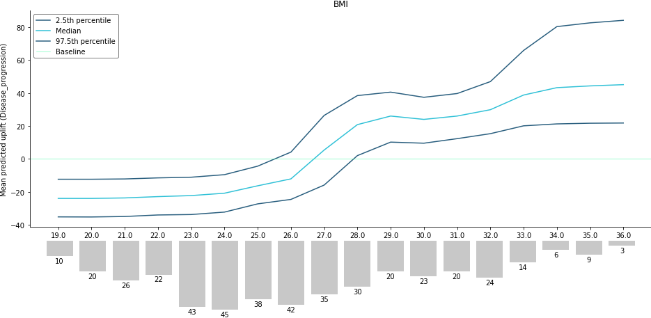

# Facet

by BCG Gamma


Facet is an open source library to for human-explainable AI. It combines sophisticated
model inspection and model-based simulation to enable better explanations of your 
machine learning models.  


## Installation
Facet supports both PyPI and Anaconda

#### Anaconda

```commandline
conda install gamma-facet
```

### Pip
```commandline
pip install gamma-facet
```


## Quickstart

Facet follows the design principle that holistic model explanations require two key
 elements: 
- **Pipelining & Model Ranking**: Facet delivers a robust and fail-safe pipelining 
    workflow which allows you to easily impute and select your features as well as
    ranking a grid of different models "competing" against each other
- **Inspection**: Local explanations of features and their interactions make up a key 
    component of understanding feature importance as well as feature interactions. 
    This is based on a novel method which decomposes
    [SHAP values](https://shap.readthedocs.io/en/latest/) into 
    three vectors representing **synergy**, **redundancy**, and **independence**.
- **Simulation**: Use your trained model and the insights from the model inspection
    to conduct a historical simulation of any feature on your target in order to 
    identify local optima. 


#### Pipelining & Model Ranking

````jupyterpython
import pandas as pd
from sklearn.datasets import load_boston
from sklearndf.pipeline import RegressorPipelineDF
from sklearndf.regression import RandomForestRegressorDF

# Relevant facet imports
from facet import Sample
from facet.selection import LearnerRanker, LearnerGrid
from facet.validation import BootstrapCV

# Load boston housing dataset
boston = load_boston()
TARGET = 'MEDIAN_HOUSE_PRICE'
df = pd.DataFrame(
        data=boston.data, 
        columns=boston.feature_names).assign(MEDIAN_HOUSE_PRICE=boston.target)
sample = Sample(observations=df, target=TARGET)


rf_pipeline = RegressorPipelineDF(
    regressor=RandomForestRegressorDF()
)

# Define grid of models which are "competing" against each other
grid = [
    LearnerGrid(
        pipeline=rf_pipeline, 
        learner_parameters={ 
        "min_samples_leaf": [8, 11, 15]        
}    
    )
]

cv = BootstrapCV(n_splits=10)

# Rank your models by performance
ranker = LearnerRanker(
    grids=grid, cv=cv, n_jobs=-3
).fit(sample=sample)

# Get your summary report
ranker.summary_report()
````

```jupyterpython
Rank  1: RandomForestRegressorDF, ranking_score=    0.739, scores_mean=    0.802, 
         scores_std=   0.0315, parameters={regressor__min_samples_leaf=15}

Rank  2: RandomForestRegressorDF, ranking_score=    0.739, scores_mean=     0.79, 
         scores_std=   0.0258, parameters={regressor__min_samples_leaf=11}

Rank  3: RandomForestRegressorDF, ranking_score=    0.688, scores_mean=    0.792, 
         scores_std=   0.0519, parameters={regressor__min_samples_leaf=8}
```


#### Easy model inspection

Facet implements a number of model inspection methods for  
[scikit-learn](https://scikit-learn.org/stable/index.html) base learners. Fundamentally, 
facet enables post-hoc model inspection by breaking down the interaction effects 
of the variables that your model used for Training: 
- **Synergy** provides visibility about how features contain complementary information
    with respect to the target and team up to predict outcomes by combining their 
    information.  
- **Redundancy** identifies groups of variables that fully or partially duplicate each 
    other and do not deliver any additional information to the machin learning model.  

```jupyterpython
from facet.inspection import LearnerInspector

inspector = LearnerInspector()
inspector.fit(crossift=ranker.best_model_crossfit)
MatrixDrawer(style="matplot%").draw(inspector.feature_redundancy_matrix(), 
                                    title="Redundancy Matrix")
```


For feature synergy, we can get a similar picture
```jupyterpython
synergy_matrix = inspector.feature_synergy_matrix()
MatrixDrawer(style="matplot%").draw(synergy_matrix, title="Synergy Matrix")
```


Please see the [documentation]() for more detail. 

#### Simulation
```jupyterpython
from facet.simulation import UnivariateUpliftSimulator
from facet.simulation.partition import ContinuousRangePartitioner 
from facet.simulation.viz import SimulationDrawer

SIM_FEAT = "LSTAT"
simulator = UnivariateUpliftSimulator(crossfit = ranker.best_model_crossfit, n_jobs=3)

# Split the simulation range into equal sized partitions
partitioner = ContinuousRangePartitioner()

simulation = simulator.simulate_feature(name=SIM_FEAT, partitioner = partitioner)

SimulationDrawer().draw(
    data=simulation, title=SIM_FEAT
)
```



## Development guidelines

TBD - link to long section in documentation

## Acknowledgements

This package provides a layer on top of some popular building blocks for Machine 
Learning:  

* The [SHAP](https://github.com/slundberg/shap) implementation is used to estimate the
    shapley vectors which are being decomposed into the synergy, redundancy, and 
    independence vectors
    
* The [scikit-learn](https://github.com/scikit-learn/scikit-learn) learners and 
pipelining make up implementation of the underlying algorithms. Moreover, we tried
to design the `facet` API to align with the scikit-learn API. 


